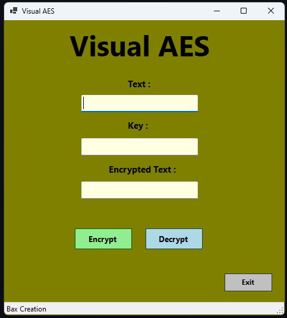

# AES Encryption/Decryption Tool

A simple Windows Forms application that allows you to encrypt and decrypt text using the **AES (Advanced Encryption Standard)** algorithm. 
This tool is designed to help users understand and interact with encryption in an easy-to-use visual interface.

---

## Features
- **Encrypt Text**: Input plain text and a key to encrypt the data.
- **Decrypt Text**: Provide the encrypted text and the same key to decrypt back to the original plain text.
- **User-Friendly Interface**: Simple and clean Windows Forms UI.
- **Error Handling**: Validates user input and provides clear error messages for invalid keys or inputs.

---

---

### Prerequisites
- Windows Operating System
- **Visual Studio 2022** or later
- .NET 8

---

### Installation

1. **Clone repository:**
	- **https://github.com/bax082024/VisualAES.git**
2. Open the `VisualAES.sln` file in **Visual Studio**.
3. **Rebuild Project** and run.

---